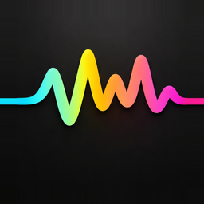

<p align="center">
  
</p>

<h1 align="center">Blablabla</h1>

<h3 align="center">Stop typing. Start talking.</h3>

<p align="center">
  The open-source voice-to-text app for macOS that types where your cursor is.<br>
  Hold a key. Speak. Release. Done.
</p>

<p align="center">
  
  
  
  
</p>

---

<br>

<p align="center">
  <strong>You think 4x faster than you type.</strong><br>
  Why are you still typing?
</p>

<br>

### The problem

Every day you type the same things: Slack replies, ChatGPT prompts, emails, code comments, Jira tickets, meeting notes. You know what you want to say — your fingers just can't keep up.

Voice-to-text apps exist, but they all suck. They open a separate window. They make you copy-paste. They don't work in your terminal. They cost $20/month.

### The solution

**Blablabla types where your cursor is.** No windows. No copy-paste. No subscriptions.

Hold a key. Speak. Release. Your words appear exactly where you were typing — Slack, VS Code, ChatGPT, Terminal, Notion, anywhere.

That's it. That's the app.

---

<br>

## See it in action

| Use case | How it works |
|----------|-------------|
| **ChatGPT prompt** | Hold key → describe your prompt → release → it's in the text box, hit Enter |
| **Slack reply** | Hold key → say your reply → release → sent in 3 seconds instead of 30 |
| **Code comment** | Hold key → explain the function → release → comment appears inline |
| **Email draft** | Double-tap to lock → talk for 2 minutes → tap to stop → entire email written |
| **Terminal command** | Hold key → "git commit -m fix auth bug" → release → it's there |

<br>

---

<br>

## Features that matter

<table>
<tr>
<td width="50%">

**Push-to-talk**<br>
Hold your shortcut, speak, release. Transcript appears at your cursor instantly. Muscle memory in 5 minutes.

**Hands-free mode**<br>
Double-tap to lock. Talk as long as you need — long emails, detailed prompts, brain dumps. Tap again when done.

**Fn key trigger**<br>
One key. No modifiers. Enable Fn as your push-to-talk button for the fastest possible workflow.

**Works in any app**<br>
If it has a text cursor, Blablabla can type into it. Slack, VS Code, Terminal, Chrome, Notion, Mail, Pages — everything.

</td>
<td width="50%">

**20+ languages, zero config**<br>
Speak English, Spanish, French, German, Portuguese, Italian... the model auto-detects. Switch languages mid-sentence if you want.

**Floating indicator**<br>
A tiny waveform pill above your dock. Shows recording state, audio levels, and locked mode. Follows your active monitor.

**Transcript history**<br>
Searchable, paginated history of everything you've dictated. Copy any past transcript with one click.

**100% private**<br>
Your API key. Your audio. Direct to AssemblyAI. No middleman server. No telemetry. No analytics. Fully open source.

</td>
</tr>
</table>

<br>

---

<br>

## How much does it cost?

**$0.**

Blablabla is free and open source. You bring your own AssemblyAI API key:

- **$50 free credit** on signup (that's ~135 hours of streaming)
- **10 hours/month free** after that
- Pay-as-you-go: $0.37/hour if you go over

For most people, the free tier is more than enough. You'd need to dictate **20 minutes every single day** to hit the limit.

<p align="center">
  <a href="https://www.assemblyai.com/dashboard/signup"><strong>Get your free API key →</strong></a>
</p>

<br>

---

<br>

## Get started in 2 minutes

```bash
# 1. Install XcodeGen if you don't have it
brew install xcodegen

# 2. Clone and build
git clone https://github.com/arturogj92/blablabla.git
cd blablabla
xcodegen generate

# 3. Build and run
xcodebuild -project Blablabla.xcodeproj -scheme Blablabla build
open ~/Library/Developer/Xcode/DerivedData/Blablabla-*/Build/Products/Debug/Blablabla.app
```

Or just open `Blablabla.xcodeproj` in Xcode and hit **Cmd+R**.

### First launch

1. Paste your AssemblyAI API key
2. Grant Microphone, Accessibility, and Input Monitoring permissions
3. Restart the app
4. Hold your shortcut and talk

Default shortcut: **Option + Shift + §** (customizable in Settings)

<br>

---

<br>

## Controls

| Action | Result |
|--------|--------|
| **Hold shortcut** | Push-to-talk — records while held |
| **Double-tap shortcut** | Locks recording hands-free |
| **Tap while locked** | Stops and transcribes |
| **Hold Fn** *(optional)* | Push-to-talk with one key |
| **Click dock pill** | Toggle recording |
| **Right-click dock pill** | Recent transcripts menu |

<br>

---

<br>

## Built with

- **Swift** + **AppKit** + **SwiftUI** — 100% native macOS, no Electron, no web views
- **AssemblyAI Universal Streaming v3** — real-time, multilingual speech-to-text
- **CGEvent taps** — true global shortcuts that work in any app
- **Accessibility APIs** — direct text insertion without clipboard pollution
- **AudioToolbox** — native system sounds that don't interrupt audio capture
- **XcodeGen** — clean, reproducible project generation

<br>

---

<br>

## Contribute

Blablabla is open source and contributions are welcome. Some ideas we'd love help with:

| Feature | Description |
|---------|-------------|
| **AI post-processing** | Clean up grammar, remove filler words, or reformat with an LLM before pasting |
| **Voice commands** | "Delete that", "new paragraph", "undo last sentence" |
| **Output templates** | Format as bullet points, email, code comment, meeting notes |
| **Whisper offline mode** | Local transcription fallback when there's no internet |
| **Auto-launch at login** | Start with macOS automatically |

<br>

---

<br>

<p align="center">
  <strong>Stop typing. Start talking.</strong><br><br>
  <a href="https://github.com/arturogj92/blablabla"></a>
</p>

<br>

## License

MIT — use it, fork it, ship it.
